<!-- hero: monochrome halftone portrait (reveals with scanline) beside a neofetch-style info
     panel. regenerate portrait: python scripts/prep_photo.py <photo> &&
     python scripts/make_halftone_svg.py ; info panel: python scripts/make_info_card.py -->
<table>
<tr>
<td valign="top"></td>
<td valign="top"></td>
</tr>
</table>

 

[tinyurl.com/clashlex](https://tinyurl.com/clashlex)

